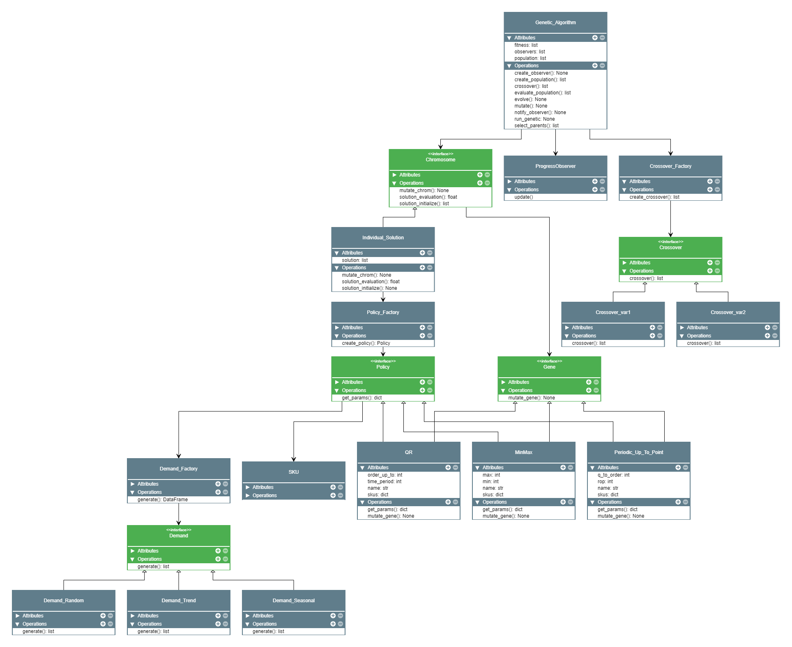

# Invenotry Simulation 

## Project Overview

### Background & Challenge 

In Oil & Gas multiple critical processes are dependent on chemicals. Among others, these include:
  
-	**E&P value cycle:**  If a geological system gives the confidence that there is working petroleum, exploration, appraisal, and production wells will be drilled; this process requires a lot of chemicals to be available (one-off or continuous inflow)

-	**Late field life:** when a field starts producing only water, this water will need to be purified

Chemicals need to be available at the right time and place, as production must continue at all costs. It is expected that one day’s Production is worth much more than the overall spending on chemicals in one year. Operators will “over” pay for chemicals due to the high opportunity cost. 

### Objective

How should the ordering and storage of raw materials/chemicals be scheduled to ensure production uptime and compliance with the inventory restrictions while minimizing cost?  

### Solution

The solution is a **simulation-based approach** to inventory and procurement planning which allows for the exploration of different planning scenarios to better understand the impact of each variable (number of suppliers, lead times, capacity constraints, etc) on inventory management.

The **simulator** iterates through random inventory policy configurations to find the optimal combination of policies for all items for the specified time period. In each simulation, the following parameters are explored:
-	Policy type (Periodic or Continuous) 
-	Review period (Days)
-	Quantity to order 

## Code Base

### UML Diagram

